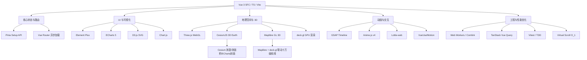

# 🚀 Vue 3 + TypeScript + Vite 现代前端全栈生态与组件化实战大画板

本项目是一个基于 **Vue 3 (Composition API / `<script setup>`)**、**TypeScript** 和 **Vite** 构建的高水准、高保真、多维度的前端技术全景演练场（Playground）。

项目集成了当前前端生态中最具代表性的主流第三方库（包括 3D 图形、数据可视化、动画引擎、GIS 地理空间、多线程计算、性能优化、富文本编辑、文件处理及各类实用工具库），并结合 **Element Plus** 和自定义 **SCSS 样式系统**，构建了一个支持明暗模式切换、极具科技感与视觉美学的统一响应式 Dashboard 演示大系统。

---

## 🎨 核心设计与视觉体系

项目遵循现代 Web 设计的最佳实践，打造极具质感和交互性的界面：
1. **多态主题切换**：基于 CSS 变量与 SCSS 变量混合构建的亮色/暗色（Dark Mode）一键无缝切换，界面背景、文字、边框、卡片均支持渐变过渡。
2. **轻量玻璃态美学**：使用和谐的 HSL 柔和色彩体系，卡片及气泡弹窗均带有轻微毛玻璃滤镜（`backdrop-filter`）、悬停阴影微动效（Micro-animations）和渐变边框。
3. **响应式与无缝布局**：采用 Mobile-First 和 Flexbox/Grid 混合布局，侧边栏支持按需折叠。所有图表和画布（WebGL/SVG）具备自适应容器缩放的监听器，杜绝容器溢出或显示错位。
4. **统一代码演示机制**：每个功能模块均配有统一封装的 `DemoCard` 组件，支持一键复制代码段、展开查看实现细节。

---

## 🛠️ 技术栈与生态系统



### 1. 核心底座
- **框架版本**：Vue 3.4+ (SFC `<script setup>` 组合式 API)
- **开发语言**：TypeScript 5.0+ (严格类型推断与安全防护)
- **构建工具**：Vite 5.0+ (极速热重载，采用 Rolldown 预构建与打包)
- **状态管理**：Pinia (Setup API 风格，支持深度响应式同步与持久化)
- **路由方案**：Vue Router 4 (具备 NProgress 全局路由切换加载进度条)
- **样式处理**：Sass / Dart Sass (采用现代 `@use` 代替 `@import`，避免全局作用域污染与编译警告)

---

## 📂 项目功能模块全景 (10个阶段演进)

项目按照渐进式阶段开发，每个阶段都集成了对应领域的顶尖三方库，包含深度注释与交互演练：

### 🧱 阶段 1：状态管理与 UI 基础
- **Pinia 状态管理实战**：
  - **基础计数器**：演示同步/异步修改状态及派生 Getters (DoubleCount)。
  - **任务清单 (Todo)**：利用 `watch` 深度侦听并同步本地 `LocalStorage`。
  - **购物车系统**：设计跨组件的 Actions 联动，处理复杂商品库存扣减与价格计算。
- **Element Plus 精选组件**：
  - **基础组件**：状态 Tag、角标 Badge、圆角头像与评分 Rate。
  - **账户注册表单**：支持多选、级联、开关切换和完备 Rules 规则校验。
  - **用户数据表格**：支持前端搜索筛选、页码控制与折叠详情展开。
  - **交互式弹窗**：模态 Dialog、侧边 Drawer、阻断 Confirm 以及 Loading 状态管理。

### 📈 阶段 2：数据可视化 (ECharts & D3.js)
- **ECharts 5 深度集成**：
  - 采用 **Tree-Shaking 按需导入注册** 优化，将首屏开销削减近 60%。
  - 渐变色面积填充系统指标折线图、自适应分组/堆叠/横向柱状图、南丁格尔玫瑰图、环形占比图以及动态刷新 KPI 大屏看板。
- **D3.js 数据驱动 SVG 可视化**：
  - **动态柱状图**：演示 D3 经典的 `enter-update-exit` 数据绑定与平滑插值动画。
  - **力学仿真网络图 (Force Graph)**：利用多体排斥力、连线拉力与碰撞检测配置仿真器，支持拖拽锁定与邻接节点高亮。
  - **嵌套树图 (TreeMap)**：还原 Bundle Analyzer 风格，动态计算模块体积与文件项数。
  - **地理投影地图 (GeoMap)**：基于 Mercator 地理投影绘制中国热力色系地图，支持数据随机刷新。

### 🌌 阶段 3：3D 渲染 (Three.js) & 动画引擎 (GSAP/Anime/Lottie)
- **Three.js 交互场景**：
  - 经典 OrbitControls 轨道控制器 3D 立方体。
  - 多种几何网格体（球、圆柱、圆环等）参数实时在线调试。
  - 材质与光影：MeshStandardMaterial/ToonMaterial 配合点光源、聚光灯阴影投射。
  - **大气辉光 3D 地球**：加载高清纹理，采用自定义 Shader 编写散射大气辉光特效。
  - **五千粒子星海**：使用 Points 材质与 BufferGeometry 构建受风力与波幅控制的波动粒子云。
- **现代动画大集成**：
  - **GSAP**：补间动画、Timeline 时间轴串联机械手臂多步骤协同动作、错落 staggers 弹性网格。
  - **Anime.js v4**：运用新版模块化接口，实现 SVG 手写轨迹绘制、关键帧物理弹跳与数值缓动大屏数字翻滚。
  - **Lottie 动画**：集成 `lottie-web`，支持离线 JSON 读取、网络跨域源解析，提供倍速、正反向播放、Slider 帧级别微调等控制。

### ⚙️ 阶段 4：高级应用场景 (富文本/Excel/PDF/i18n/拖拽)
- **Tiptap 无头富文本编辑器**：定制精致的编辑栏，支持 HTML 及结构化 JSON 视图输出，提供独立的阅读预览区。
- **SheetJS (xlsx) 电子表格处理**：支持拖拽上传本地 Excel 自动转为表格状态，支持行级增删改，并支持一键导出编辑后的数据为 Excel。
- **Retina 高清 PDF 票据打印**：基于 `html2canvas` 捕获发票 DOM 生成高清 PNG，结合 `jsPDF` 比例换算，支持完美的多页 A4 导出，具备防溢出截断设计。
- **vue-i18n 9+ 国际化多语言**：支持中英文无缝切换，实现输入提示符、页面文案、校验规则及 Day.js 本地化时间的联动更新。
- **SortableJS 敏捷任务看板**：支持“待处理”、“开发中”及“已完成”卡片的上下拖拽排序与跨栏分发，拖动结束自动同步 Vue 响应式状态。
- **10万条数据 O(1) 虚拟滚动**：手写虚拟列表，通过 `scrollTop` 计算可视切片，解决传统海量 DOM 的卡顿，提供 FPS 和节点数实时监控。

### 🔬 阶段 5：工程化实践与扩展生态
- **TanStack Vue Query**：缓存管理、乐观更新（Optimistic Updates）无延迟刷新 UI、无限滚动列表。
- **Vitest 交互式单元测试运行器**：页面集成测试运行面板，可一键执行 Vitest 单元测试断言，直观展示 counter 状态与 DemoCard 组件的单元测试结果。
- **VeeValidate & Zod**：基于 schema 的 TypeScript-first 表单校验，编写三步向导表单及文件大小校验。
- **Leaflet 地理地图**：加载 OpenStreetMap 瓦片地图，绘制 GeoJSON 省级边界高亮、热力 GDP 数据点及点击打点功能。
- **Chart.js 混合图表**：Canvas 双 Y 轴 Line+Bar 混合图，支持实时追加数据点的定时滚动折线图，并提供 ECharts 对比卡片。
- **VueUse 进阶 Hooks**：包含图片懒加载、FPS 帧率监控、Websocket 实时消息网关及 GPS 地理位置获取。
- **Markdown 编辑与 Shiki 代码高亮**：左侧 Markdown 编辑，右侧 Shiki 主题着色（支持 5 种主题动态切换），支持一键导出 Markdown。

### 📱 阶段 6：移动端适配与交互动画增强
- **Swiper 移动滑动**：3D Coverflow（卡片折叠）、Fade（淡入淡出）、Parallax（视差滚动背景与文字）。
- **VueUse Motion 声明式物理动效**：基于 directive 注入 initial 进场、hover 卡片悬起与 tap 缩放，支持拖拽物理球自动回弹。
- **Driver.js 仪表盘新手向导**：支持配置高亮遮罩透明度、高亮间距与分步式引导流程。
- **Vue Advanced Cropper 头像裁剪**：支持圆形/自由矩形裁剪、图片旋转镜像翻转，实时输出裁剪框锚点像素坐标并下载图片。

### 🚀 阶段 7：地理空间 WebGL & 多线程计算优化
- **Maplibre GL 3D 园区地图**：高性能 WebGL 矢量地图底图，加载 GeoJSON 绘制科技园区大楼的 **3D 建筑体块挤压拉伸**，支持基于滑块动态缩放建筑物高度，以及各城市间的 3D 飞行航线平滑转场（Fly-to）。
- **Maplibre + deck.gl 进阶联动 (Option B)**：使用 `@deck.gl/mapbox` 将 deck.gl 渲染器作为 Overlay 叠加于 Maplibre 地图之上。支持渲染全球发光流动航线（ArcLayer）、动态散点聚集成 3D 蜂窝柱状体（HexagonLayer，其高度与颜色自适应数据密度变化）以及数万个高频扩散雷达散点（ScatterplotLayer）。配备自研 FPS 帧率计数器与 HUD 数据面板，支持在 1k - 100k 数据量及 Hexagon 聚合参数下动态调节并流畅渲染。
- **Web Workers & Comlink 多线程计算**：使用 Comlink 进行 RPC 封装，在后台 Worker 中执行 150 万数据排序与 2500 万次数学迭代。提供主线程阻塞与 Worker 线程的⚙️齿轮帧率直观对比。
- **Floating UI 高精度气泡与右键虚拟菜单**：支持自适应 flip（翻转）与 shift（位移）的 Tooltip，并基于 clientX/clientY 虚拟锚点实现画布区域的自定义右键快捷菜单。

### 🛠️ 阶段 8：实用交互工具类库
- **Fabric.js 交互画板**：自由画笔、圆/矩/线多要素绘制、文字添加，支持颜色粗细调节、拖拽旋转缩放、撤销及一键导出 PNG。
- **NProgress 路由进度条**：拦截 Vue Router 全局路由切换，提供配置面板调节速度、缓动、自动递增与慢请求联动。
- **tsParticles 高性能粒子特效**：包含星空连线、落雪、烟花爆炸效果预设与速度粒子参数在线调整。
- **QRCode 响应式二维码生成器**：支持 Canvas/SVG/Image 模式，自定义前后背景色、纠错等级与高清下载。
- **Typed.js 智能打字机**：支持多句循环打字/擦除，带打字音效和光标闪烁，可调节各项速度及延迟。

### 🏢 阶段 9：专业场景集成
- **Vue Flow 流程图编辑器**：支持左侧面板拖拽新增节点、删除节点、动态连线与视口缩放、网格背景、鹰眼缩略图。
- **XTerm.js 浏览器 Web 终端**：模拟标准 Shell，支持退格、回显、ANSI 颜色输出，内置命令（help、clear、system 等），支持自适应 fit 窗口。
- **Monaco Editor (VS Code 核心)**：在线 IDE 级编辑器，支持智能提示、多语言（TS/JS, HTML, CSS, JSON）快速切换与明暗主题切换。
- **Wavesurfer.js 音频波形播放器**：精准提取音频频域数据渲染波形，支持播放/暂停、滑动跳转、倍速调整、波形缩放（分贝）及颜色客制化。
- **VCalendar 事件日历看板**：支持日历日程挂载彩色 Dots/Bars 标记属性，支持日程的 CRUD 以及侧边栏联动。

### 🌍 阶段 10：CesiumJS 3D 地球与手绘风文本标注
- **CesiumJS 三维地球仿真**：
  - 基于 shallowRef（防范 Vue 深层劫持导致的性能劣化）与 CartoDB 极简暗色底图构建。
  - 支持 3D 地形高度起伏（createWorldTerrainAsync）、日照大气特效与深度碰撞遮挡。
  - 预设著名坐标（珠峰、曼哈顿等）的 3D Fly-To 航线转场及自动绕点水平巡航。
  - 绘制 3D Billboard Pin、赤道轨迹线以及覆盖上海周边的 3D 电磁防护罩（防空网）。
  - 使用 `SampledPositionProperty` 物理计算并渲染卫星绕地球运动轨道动画。
  - **交互式空间测量与剖面分析 (Option C)**：在三维地球上，使用 `ScreenSpaceEventHandler` 捕获鼠标左键点击（放置控制点）、鼠标移动（线段/多边形实时回显）与右键/双击（固化闭合），基于 `CallbackProperty` 绘制高帧率测距折线与测面积多边形。采用 `EllipsoidGeodesic` 测地线计算精确的球表面距离；通过 ENU 局部正交切平面投影与鞋带定理计算多边形面积。路径支持等距差值采样高程，开启 3D 地形时异步调用 `sampleTerrainMostDetailed` 获取真实海拔，在离线/无地形服务时采用高精度分形噪声算法模拟生成高程波形，联动 ECharts 图表展示精美的高度剖面图。
- **Signature Pad 电子合同签署系统**：手写钢笔压感签字板，提供 NDA 合同模板，支持一键合成电子签名，并高清导出 A4 规格的 PDF 及 PNG。
- **Rough Notation 手绘风格文本标注**：提供 Highlight/Underline/Box 等 6 种手写标注动效，支持鼠标悬停触发与顺序链式播放。

---

## 📂 项目目录结构

```text
vue3-libs-playground/
├── src/
│   ├── __tests__/             # Vitest 单元测试用例 (Counter, DemoCard, MountViews)
│   ├── assets/
│   │   ├── data/              # 离线中国地图 GeoJSON 等数据源
│   │   └── styles/            # 样式层
│   │       ├── variables.scss # 主题色彩与间距变量 (由各组件 @use as * 引用)
│   │       └── global.scss    # 全局重置样式与滚动条
│   ├── components/
│   │   ├── common/            # 通用基础组件 (如 DemoCard)
│   │   └── layout/            # 布局组件 (AppLayout, AppHeader, AppSidebar)
│   ├── i18n/                  # 中英文翻译语言包 (zh-CN / en-US)
│   ├── router/                # 路由配置 (按需异步懒加载与 NProgress 联动)
│   ├── stores/                # Pinia 状态树 (counter, todo, cart)
│   ├── utils/                 # 工具封装 (如 ECharts 树状 Tree-shaking 注册器)
│   ├── views/                 # 各个阶段的演示页面
│   │   ├── home/              # 首页
│   │   ├── pinia/             # 阶段 1 状态
│   │   ├── element-plus/      # 阶段 1 UI
│   │   ├── echarts/           # 阶段 2 ECharts
│   │   ├── d3js/              # 阶段 2 D3.js
│   │   ├── threejs/           # 阶段 3 Three.js
│   │   ├── animation/         # 阶段 3 动画
│   │   ├── vueuse/            # 阶段 3 VueUse
│   │   ├── utils/             # 阶段 3 工具
│   │   ├── advanced/          # 阶段 4 高级
│   │   ├── phase5/            # 阶段 5 工程实践
│   │   ├── phase6/            # 阶段 6 移动适配
│   │   ├── phase7/            # 阶段 7 空间多线程
│   │   ├── phase8/            # 阶段 8 实用交互
│   │   ├── phase9/            # 阶段 9 专业集成
│   │   ├── exploration/       # 阶段 10 前沿探索 (Signature, RoughNotation)
│   │   └── cesium/            # 阶段 10 CesiumJS 地球
│   ├── App.vue                # 根组件
│   └── main.ts                # 入口文件 (装配插件，初始化 tsParticles 等)
├── index.html                 # 主入口 HTML
├── tsconfig.json              # TS 全局配置
├── vite.config.ts             # Vite 打包与手动分包构建配置
└── package.json               # 依赖库清单
```

---

## ⚡ 性能优化与工程细节 (Best Practices)

为保证项目引入庞大的三方库时依然具备顺畅的加载性能，我们在构建和编码层面实施了多项优化：

1. **ECharts 5 局部注册**：
   通过 [echarts.ts](file:///d:/Projects/ClaudeCodeProject/FrontendStudy/vue3-libs-playground/src/utils/echarts.ts) 进行了严格的 Tree-Shaking，只加载业务所需的图表和核心组件，减小了最终主包体积。
2. **Vite 细粒度分包 (Code Splitting)**：
   在 `vite.config.ts` 中通过配置 `rollupOptions.output.manualChunks`，将 `Cesium`、`Monaco Editor`、`Three.js`、`Maplibre GL`、`PDF/Excel工具` 以及 `Element Plus` 分割为独立的 Chunk。主页面加载时，只有在进入对应组件后才会动态加载对应的异步包。
3. **防止 Vue 对重度渲染对象进行深层劫持**：
   在 `Cesium` 与 `Three.js` 的 3D 画布实例化中，使用 `shallowRef` 甚至是非响应式的普通变量来缓存实例。避免 Vue 深度扫描代理庞大的三维顶点和几何拓扑数据，保证 60fps 极限帧率。
4. **Dart Sass 3.0.0 @use 语法规范**：
   摒弃了全局 `@import` 指令，彻底解决了新版 Dart Sass 的构建弃用警告，将样式划分为独立的模块（Variables & Mixins），由需要的组件按需局部引用，实现了清晰的作用域管理。

---

## 🚀 启动与运行指南

### 1. 克隆与安装依赖
在终端中进入项目目录，并使用 `npm` 进行依赖安装：
```bash
npm install
```

### 2. 本地开发服务器启动
```bash
npm run dev
```
启动后，在浏览器中访问控制台输出的地址（默认为 `http://localhost:5173/`）。

### 3. 执行生产编译与打包
```bash
npm run build
```
打包成功后，静态文件和分包后的 `.js` / `.css` 资源会被生成在 `dist` 目录下，并带有对应的 Gzip 预压缩包。

### 4. 运行单元测试
```bash
npm run test
```
可以启动 Vitest 测试框架，运行全局定义的单元测试用例，校验状态机和核心组件的正确性。
